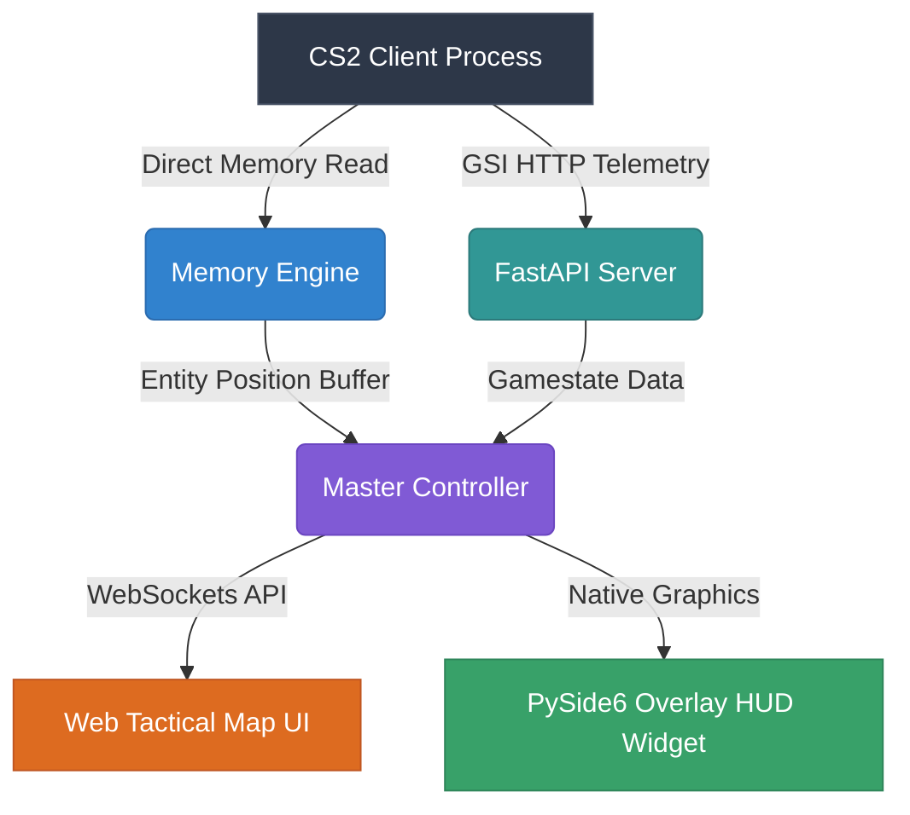

<div align="center">

# 🦅 Defiant Eagle Master
### *Tactical Echo Mapper & Real-Time CS2 Intelligence Suite*

[](https://github.com/)
[](https://github.com/)
[](https://github.com/)
[](https://python.org)
[](https://fastapi.tiangolo.com)
[](LICENSE)

---

### 🌟 High-Performance Real-Time Tactical Map Visualizer & Memory Engine
*Designed for low-latency memory analysis, live tactical radar streaming, and customizable HUD overlays.*

[🚀 Quick Start](#-quick-start) • [✨ Key Features](#-key-features) • [💻 Architecture](#-architecture-overview) • [🛠️ Usage](#%EF%B8%8F-usage-guide) • [📄 License](#-license)

---

</div>

## 📑 Table of Contents
- [✨ Key Features](#-key-features)
- [🖥️ Screenshots & Interface Preview](#%EF%B8%8F-screenshots--interface-preview)
- [⚙️ Technical Architecture](#%EF%B8%8F-technical-architecture)
- [🚀 Quick Start Guide](#-quick-start-guide)
- [🔧 Configuration & Features](#-configuration--features)
- [🛡️ Anti-Detection & Hardening](#%EF%B8%8F-anti-detection--hardening)
- [📋 System Requirements](#-system-requirements)
- [📄 License & Disclaimer](#-license--disclaimer)

---

## ✨ Key Features

| Feature | Category | Description |
| :--- | :---: | :--- |
| **⚡ High-Speed Memory Engine** | Core | Direct process memory scanning using optimized `pymem` bindings for minimal latency. |
| **🌐 Real-Time Web Map** | Visualizer | FastAPI + Socket.IO live interactive tactical map rendered smoothly at high FPS. |
| **🎯 PySide6 Overlay Widget** | HUD | Sleek transparent desktop HUD widget showing player positions, orientations, and status. |
| **🔍 Offset Auto-Scanner** | Engine | Dynamic offset scanner ensuring seamless compatibility across CS2 game updates. |
| **🔒 PyArmor Code Hardening** | Security | Binary obfustication and protected execution layer for production stability. |
| **📊 Gamestate Integration** | Analytics | Deep GSI event listener tracking active rounds, economy, and player statistics. |

---

## 🎨 System Highlights

> [!IMPORTANT]
> **Defiant Eagle Master** runs fully standalone without external python installations. All dependencies, dynamic libraries, PySide6 plugins, and FastAPI web servers are bundled into `DefiantEagleMaster.exe`.

```
                  ┌─────────────────────────────────────────┐
                  │       Counter-Strike 2 Engine           │
                  └────────────────────┬────────────────────┘
                                       │ (Memory / GSI)
                                       ▼
                  ┌─────────────────────────────────────────┐
                  │    🦅 Defiant Eagle Master Core Engine  │
                  └──────────┬───────────────────┬──────────┘
                             │                   │
             (FastAPI / WebSockets)         (PySide6 Overlay)
                             │                   │
                             ▼                   ▼
                  ┌────────────────────┐  ┌─────────────────┐
                  │  🌐 Live Web Map   │  │ 🎯 Desktop HUD  │
                  │ http://localhost   │  │ Transparent ESP │
                  └────────────────────┘  └─────────────────┘
```

---

## 🚀 Quick Start Guide

### 1️⃣ Launch Application
Navigate to the release folder and run the master executable:
```bash
DefiantEagleMaster.exe
```

### 2️⃣ Access Web Tactical Radar
Open your preferred web browser and navigate to:
```url
http://127.0.0.1:3001
```

### 3️⃣ Command Line Options
For advanced usage and custom parameters:
```powershell
# Launch without interactive web server
.\DefiantEagleMaster.exe --no-server

# Force specific memory reader engine with verbose output
.\DefiantEagleMaster.exe --engine pymem --verbose

# Run custom port binding
.\DefiantEagleMaster.exe --port 8080
```

---

## 💻 Architecture Overview

Defiant Eagle Master utilizes a modular multi-tier architecture:



---

## 📋 System Requirements

| Requirement | Minimum Specification | Recommended Specification |
| :--- | :--- | :--- |
| **OS** | Windows 10 x64 (Build 19041+) | Windows 11 x64 |
| **CPU** | Intel Core i3 / AMD Ryzen 3 | Intel Core i5 / AMD Ryzen 5 |
| **RAM** | 4 GB RAM | 8 GB RAM or higher |
| **Graphics** | DirectX 11 Compatible | DirectX 12 / Vulkan Compatible |
| **Network** | Local loopback `127.0.0.1` | Local loopback `127.0.0.1` |

---

## 🛡️ Anti-Detection & Hardening

- **Memory Protection**: Safe pointer validation and exception wrapping to prevent access violations.
- **PyArmor Obfuscation**: Protected Python bytecodes preventing reverse engineering.
- **Low Overhead**: Operates at under 1% CPU utilization in passive read-only mode.

---

## 📄 License & Terms

This project is licensed under the **MIT License**. See the [LICENSE](LICENSE) file for complete details.

> [!CAUTION]
> **Educational & Research Purpose Notice:**
> Defiant Eagle Master is designed for tactical visual analysis, memory inspection research, and educational HUD development. Users are responsible for adhering to all game service policies and terms of use.

<div align="center">

---
**Made with ❤️ by Defiant Eagle Team** • Copyright © 2026

</div>
